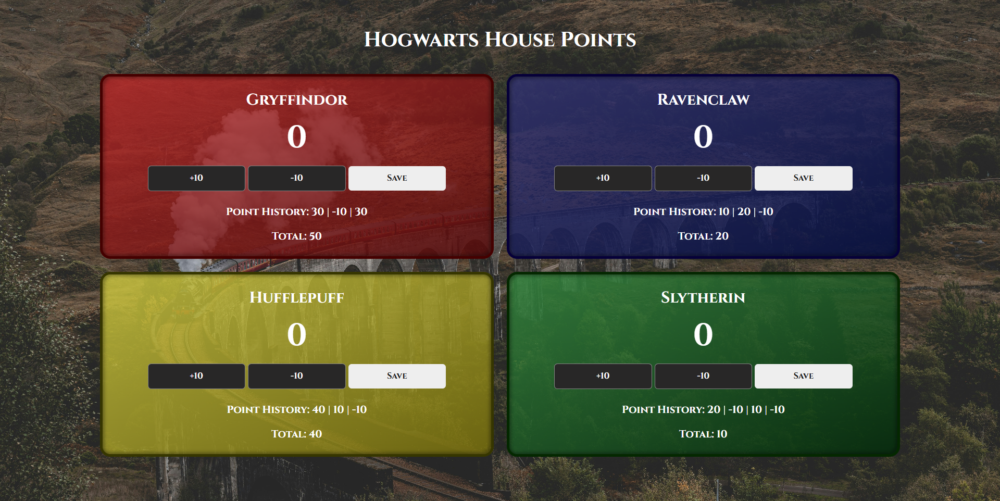

# 🏰 House Points Counter

This webpage is a **Hogwarts-themed house points tracker**, where users can add, subtract, and save points for **Gryffindor, Ravenclaw, Hufflepuff, and Slytherin**. It keeps track of **current points**, **point history**, and **total score** for each house, making it easy to manage house competitions.

## 🛠️ Technologies
- HTML5  
- CSS3  
- JavaScript (ES6)

## 🚀 Features

- Increment or decrement points for each house with **+10/-10 buttons**.  
- **Save points** to log the entry and update the total score.  
- Displays **point history** for each house.  
- Real-time updates for current points, history, and total score using DOM manipulation.  
- Hogwarts-inspired UI with **house-themed colors** and **Cinzel font**.  
- Responsive layout using **CSS grid** for all screen sizes.

## 🧠 What I Learned / Process
- Practiced **organizing data** in JavaScript objects for multiple entities (houses).  
- Learned **dynamic DOM caching** using object keys and `getElementById`.  
- Applied **event listeners** efficiently for similar buttons across multiple houses.  
- Managed **state updates** for points, history, and totals in a modular way.  
- Enhanced skills in **CSS styling** and **responsive layout** using grid and gradients.

## 💡 Future Improvements
- Highlight the **leading house** dynamically.  
- Include **countdown timer** for competitions or rounds 
- Allow **custom point increments** rather than fixed +10/-10.
- Save scores and history to local storage so progress isn’t lost on page refresh.
- Add a “Clear Scores” button to reset all house points easily.
- Add **animations** for point updates to make it more interactive.  

## 🖼️ Preview

## 📚 Sources & References
Background photo by [Cameron Gibson](https://unsplash.com/@cgcreates?utm_content=creditCopyText&utm_medium=referral&utm_source=unsplash) on [Unsplash](https://unsplash.com/photos/white-smoke-coming-from-brown-and-green-mountain-wtLn23YbuTE?utm_content=creditCopyText&utm_medium=referral&utm_source=unsplash")
